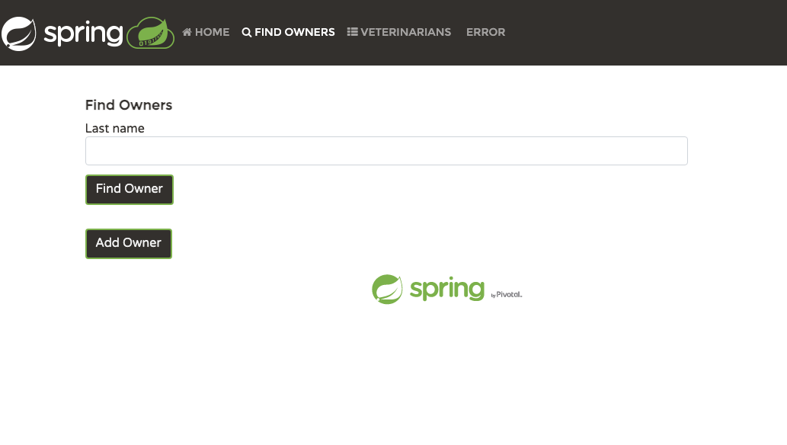
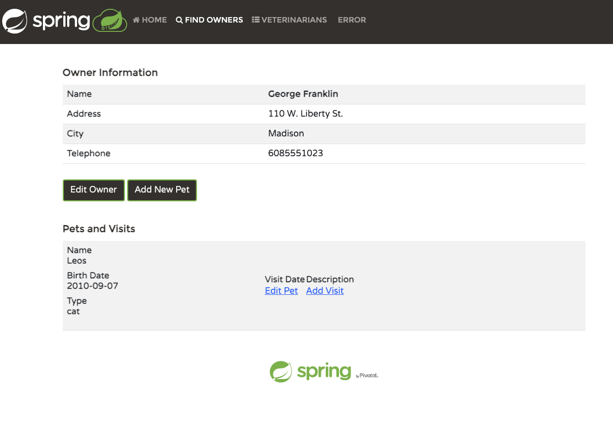
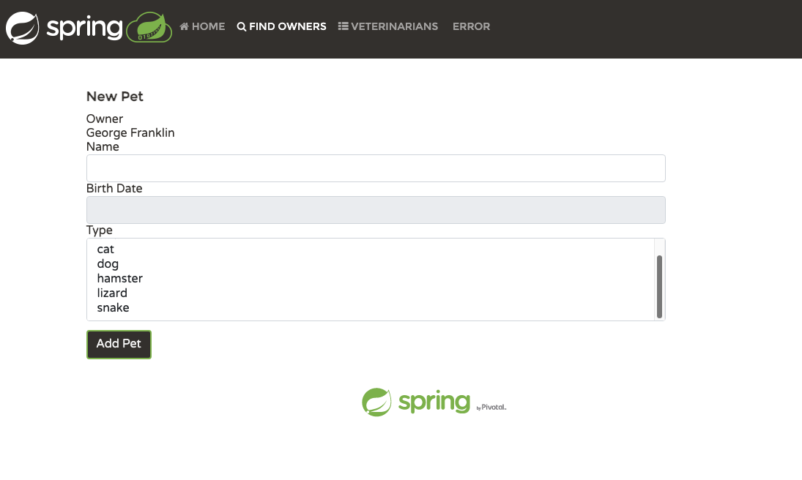

# Pet Clinic API

There are 4 projects in this repository

| Project Name                                           | Language | Status      |
|--------------------------------------------------------|----------|-------------|
| spring-petclinic                                       | Java     | cloned      |
| kotlin-petclinic                                       | Kotlin   | cloned      |
| [axum-petclinic-service](./axum-petclinic-service)     | Rust     | in-progress |
| [fiber-petclinic-service](./fiber-petclinic-service)   | Go       | in-progress |
| [fiber3-petclinic-service](./fiber3-petclinic-service) | Go       | in-progress |
| [gin-petclinic-service](./gin-petclinic-service)       | Go       | in-progress |

## Goal
The goal of this repository is to implement a pet clinic API in different languages and frameworks. These are endpoints:

| Method | Endpoint                        | Description                                |
|--------|---------------------------------|--------------------------------------------|
| GET    | /v1/owners/all                  | Get all owners                             |
| GET    | /v1/owners/{id}                 | Search owner by id                         |
| GET    | /v1/owners/{id}/pets            | Search owner associated with pets by id    |
| GET    | /v1/owners?last-name={lastName} | Search owners by last name                 |
| POST   | /v1/owners                      | Add new owner                              |
| PUT    | /v1/owners/{id}                 | Update owner                               |
|        |                                 |                                            |
| GET    | /v1/pets/all                    | Get all pets                               |
| GET    | /v1/pets/{id}                   | Search pet by id                           |
| GET    | /v1/pets/{id}/visits            | Search pet with visits by id               |
| POST   | /v1/pets                        | Add new pet                                |
| PUT    | /v1/pets/{id}                   | Update pet                                 |
|        |                                 |                                            |
| GET    | /v1/visits/all                  | Get all visits                             |
| GET    | /v1/visits/{id}                 | Search visit by id                         |
| POST   | /v1/visits                      | Add new visit                              |
| PUT    | /v1/visits/{id}                 | Update visit                               |
|        |                                 |                                            |
| GET    | /v1/vets/specialties            | Get all veterinarian's specialties         |
| GET    | /v1/vets/all                    | Get all veterinarians                      |
| GET    | /v1/vets/{id}                   | Search veterinarian by id                  |
| PUT    | /v1/vets/{id}/specialties       | Search veterinarian with specialties by id |
| POST   | /v1/vets                        | Add new veterinarian                       |
| PUT    | /v1/vets/{id}                   | Update veterinarian                        |
|        |                                 |                                            |

## Spring Pet Clinic Wireframe

<table>
  <thead>
    <tr>
      <th>Page</th>
      <th>Description</th>
      <th>Endpoints</th>
      <th>Page Screenshots</th>
    </tr>
  </thead>
  <tbody>
    <tr>
      <td>Home Page</td>
      <td>This is Pet Clinic Home Page to display the pet photos.  This page will not invoke any API. Click on pet image to display Search Owner Page</td>
      <td></td>
      <td>GET /owners?last-name={lastname}</td>
    </tr>
    <tr>
      <td>Search Owner Page</td>
      <td>Search Owner Page provides a Last Name text box to search owner(s) by last name.  </td>
      <td>   </td>
      <td>Row 1, Cell 3</td>
    </tr>
  </tbody>
</table>

| Page | Description | Endpoints    | Page Screenshot                                                              |
|------|-------------|--------------|------------------------------------------------------------------------------|
|      |             |              |          |
|      |             |              |            |
|      |             | POST /owners |    |
|      |             |              |  |
|      |             |              |    |
|      |             |              |  |
|      |             |              |            |
|      |             |              |                                                                              |

