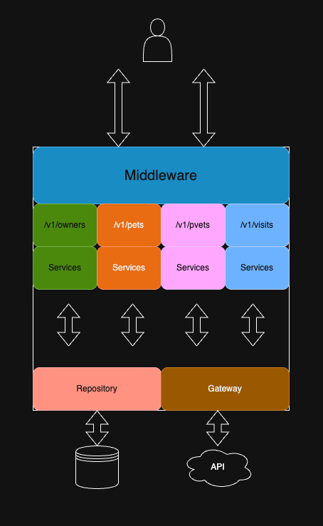

# Pet Clinic API

There are 4 projects in this repository

| Project Name                                           | Language | Status      |
|--------------------------------------------------------|----------|-------------|
| spring-petclinic                                       | Java     | cloned      |
| kotlin-petclinic                                       | Kotlin   | cloned      |
| [axum-petclinic-service](./axum-petclinic-service)     | Rust     | in-progress |
| [fiber-petclinic-service](./fiber-petclinic-service)   | Go       | in-progress |
| [fiber3-petclinic-service](./fiber3-petclinic-service) | Go       | in-progress |
| [gin-petclinic-service](./gin-petclinic-service)       | Go       | in-progress |

## Goal
The goal of this repository is to implement a pet clinic API in different languages and frameworks. These are endpoints:

| Method | Endpoint                        | Description                                |
|--------|---------------------------------|--------------------------------------------|
| GET    | /v1/owners/all                  | Get all owners                             |
| GET    | /v1/owners/{id}                 | Search owner by id                         |
| GET    | /v1/owners/{id}/pets            | Search owner associated with pets by id    |
| GET    | /v1/owners?last-name={lastName} | Search owners by last name                 |
| POST   | /v1/owners                      | Add new owner                              |
| PUT    | /v1/owners/{id}                 | Update owner                               |
|        |                                 |                                            |
| GET    | /v1/pets/all                    | Get all pets                               |
| GET    | /v1/pets/{id}                   | Search pet by id                           |
| GET    | /v1/pets/{id}/visits            | Search pet with visits by id               |
| POST   | /v1/pets                        | Add new pet                                |
| PUT    | /v1/pets/{id}                   | Update pet                                 |
|        |                                 |                                            |
| GET    | /v1/visits/all                  | Get all visits                             |
| GET    | /v1/visits/{id}                 | Search visit by id                         |
| POST   | /v1/visits                      | Add new visit                              |
| PUT    | /v1/visits/{id}                 | Update visit                               |
|        |                                 |                                            |
| GET    | /v1/vets/specialties            | Get all veterinarian's specialties         |
| GET    | /v1/vets/all                    | Get all veterinarians                      |
| GET    | /v1/vets/{id}                   | Search veterinarian by id                  |
| PUT    | /v1/vets/{id}/specialties       | Search veterinarian with specialties by id |
| POST   | /v1/vets                        | Add new veterinarian                       |
| PUT    | /v1/vets/{id}                   | Update veterinarian                        |
|        |                                 |                                            |

## Application Architecture
There are couple project layer-outs, layers and features/endpoints.
### Layers
* Middleware () - receive and process the requests and contexts prior forwarding to the router layer
* Controller/Router - receive requests and response and invoke the service layer
* Service (application logics) - receive inputs from the router layer and invoke repository layer and/gateway for more data if necessary. Process the logics and return output back to router layer
* Repository - receive inputs from service layer and find data from the database.  Return data back to service layer
* Gateway - receive inputs from service layer and search resources from API host.  Return data back to service layer
* Model - define data structures used across layers

In the layer architecture, all functions and methods are exposed to all layers.

### Features/Endpoints

In this project, I fuse both layers and features layout take advances of their pro features and apply them appropriately.

## Spring Pet Clinic Wireframe

## Spring Pet Clinic Wireframe

<table>
  <thead>
    <tr>
      <th>Page</th>
      <th>Description</th>
      <th>Endpoint</th>
      <th>Page Screenshot</th>
    </tr>
  </thead>
  <tbody>
    <tr>
      <td>Home Page</td>
      <td>Pet Clinic Home Page displaying the pet photos and navigation menu</td>
      <td></td>
      <td>No endpoint</td>
    </tr>
    <tr>
      <td>Search Owner Page</td>
      <td>Search Owners by Last Name.  A text box to search owner(s) by last name.</td>
      <td></td>
      <td>GET /v1/owners?last-name={lastName}</td>
    </tr>
    <tr>
      <td>Display Owner Info Page</td>
      <td>Display owner info & pet info.  Allow to update owner info and update pet info</td>
      <td></td>
      <td>PUT /v1/owners   PUT and POST /v1/pets   POST /v1/visits</td>
    </tr>
    <tr>
      <td>Update Owner Info Page</td>
      <td>Update owner info</td>
      <td></td>
      <td>PUT /v1/owners</td>
    </tr>
    <tr>
      <td>Add new Owner Page</td>
      <td>Add a new owner</td>
      <td></td>
      <td>POST /v1/owners</td>
    </tr>
    <tr>
      <td>Add new Pet Page</td>
      <td>Add new pet</td>
      <td></td>
      <td>POST /v1/pets</td>
    </tr>
    <tr>
      <td>Add Visit Page</td>
      <td>Add visit to a pet</td>
      <td></td>
      <td>POST /v1/visits</td>
    </tr>
    <tr>
      <td>Update Pet Page</td>
      <td>Update pet info</td>
      <td></td>
      <td>PUT /v1/pets</td>
    </tr>
    <tr>
      <td>Error Page</td>
      <td>Display Error page where an error occurs</td>
      <td></td>
      <td>No endpoint</td>
    </tr>
  </tbody>
</table>

